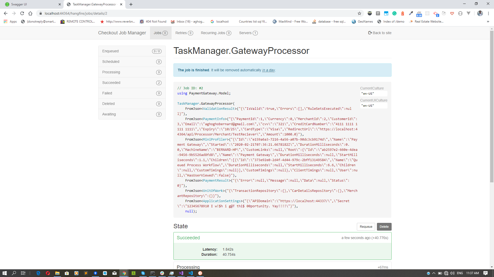

# PaymentGateWayDemo
A Demo to showcase Payment Gateway

## Assumptions
* Password used across ``` ch@ck0utA ```
* My Mock Bank has a defined set of valid cards. Any other cards used would return an invalid card error

```
new BankAccountCards{ CardNumber = "4111 1111 1111 1111", Email = "", Expiry= "10/24", Balance = 10.34M  },
new BankAccountCards{ CardNumber = "4111 1111 1111 1112", Email = "", Expiry= "3/20", Balance = 125.34M },
new BankAccountCards{ CardNumber = "4111 1111 1111 1113", Email = "", Expiry= "8/25", Balance = 150.34M },
new BankAccountCards{ CardNumber = "4111 1111 1111 1114", Email = "", Expiry= "5/23", Balance = 1299.34M },
new BankAccountCards{ CardNumber = "4111 1111 1111 1115", Email = "", Expiry= "3/19", Balance = 150000.34M },
new BankAccountCards{ CardNumber = "4111 1111 1111 1116", Email = "", Expiry= "4/21", Balance = 0.34M },
new BankAccountCards{ CardNumber = "4111 1111 1111 1117", Email = "", Expiry= "7/22", Balance = 1356.34M },
new BankAccountCards{ CardNumber = "4111 1111 1111 1118", Email = "", Expiry= "11/26", Balance = 15.34M },
new BankAccountCards{ CardNumber = "4111 1111 1111 1119", Email = "", Expiry= "12/24", Balance = 239.00M },
new BankAccountCards{ CardNumber = "4111 1111 1111 1120", Email = "", Expiry= "10/21", Balance = 3000.00M },
new BankAccountCards{ CardNumber = "4111 1111 1111 1121", Email = "", Expiry= "9/22", Balance = 100.00M},
new BankAccountCards{ CardNumber = "4111 1111 1111 1122", Email = "", Expiry= "11/24", Balance = 5000.00M },
new BankAccountCards{ CardNumber = "4111 1111 1111 1123", Email = "", Expiry= "7/25", Balance = 200 },
new BankAccountCards{ CardNumber = "4111 1111 1111 1124", Email = "", Expiry= "11/19", Balance = 1000.35M }
```

* MockAcquiringBank Endpoint
```bash
{
  "Logging": {
    "LogLevel": {
      "Default": "Information",
      "Microsoft": "Warning",
      "Microsoft.Hosting.Lifetime": "Information"
    }
  },
  "AllowedHosts": "*",
  "MockBankUri": "https://localhost:44308/",
    ...
}
```

**Please SPECIFY ENDPOINT TO MOCK Bank Url in** [appsettings.json](/CheckoutPaymentGatewayDemo/PaymentGateway/appsettings.json).

## Usage

* A merchant has to be created/registered using the endpoint ``` /PaymentGateway/Merchant/Registration ```
* The registered merchant would have to be authenticated using the endpoint ``` /PaymentGateway/Merchant/MerchantLogin ```. A token would be returned which the merchant would use to access resources.
* The registered merchant can use either the "synchronous" endpoint of ``` /PaymentGateway/Merchant/Process ``` to process a transaction or ``` /PaymentGateway/Merchant/Process/Queued ``` which kind of simulates a webhook. It returns the response to the provided return url.

* All Endpoint are listed in each project's swagger page


### Logs
* Logs can be found in the route directory [/Logs/](/CheckoutPaymentGatewayDemo/PaymentGateway/Logs/)

### CRON Job Manager
* Hangfire dashboard can be seen on Payment Gateway ``` /hangfire ```. If the ``` /PaymentGateway/Merchant/Process/Queued ``` endpoint is used, then it would queued up in hangfire. Log Details of each task can be seen in the Hangfire console.




#### Postman Collection
**Please download and import the collection to postman** [Checkout.postman_collection.json](/Postman Collection/Checkout.postman_collection.json).


## Commands
* build
```bash 
dotnet build 
```
* test
```bash
dotnet test 
```
* run Mock Acquiring Bank
```bash
dotnet run --project MockAcquiringBank --server.urls [https://localhost:2445 | [https://0.0.0.0:2445]
```
* run PaymentGateway
```bash
dotnet run --project PaymentGateway --server.urls [https://localhost:2345 | [https://0.0.0.0:2345]
```
* add migration 
```bash
dotnet ef migrations add [YourDescription] -c PaymentGatewayDbContext.PaymentGatewayDbContext -p PaymentGatewayDbContext 
```
* update database 
```bash
dotnet ef database update --project PaymentGatewayDbContext 
```

## Improvements
**WebHooks.**
Use of ASP.Net  Webhooks. Would be a more robust option in production instead of the manual approach i have used.


# Technologies Used
* WebApi.
* EntityFramework.
* Microsoft EF Identity.
* Sql Server Local Db.
* InMemoryDatabase.
* Docker.
* Hangfire.
* FluentValidation.
* Log4Net.
* RestSharp.
* NUnit.
* Swagger API.
* StackExchange.Profiling
* JwtBearer Token Authentication
* AutoFixture